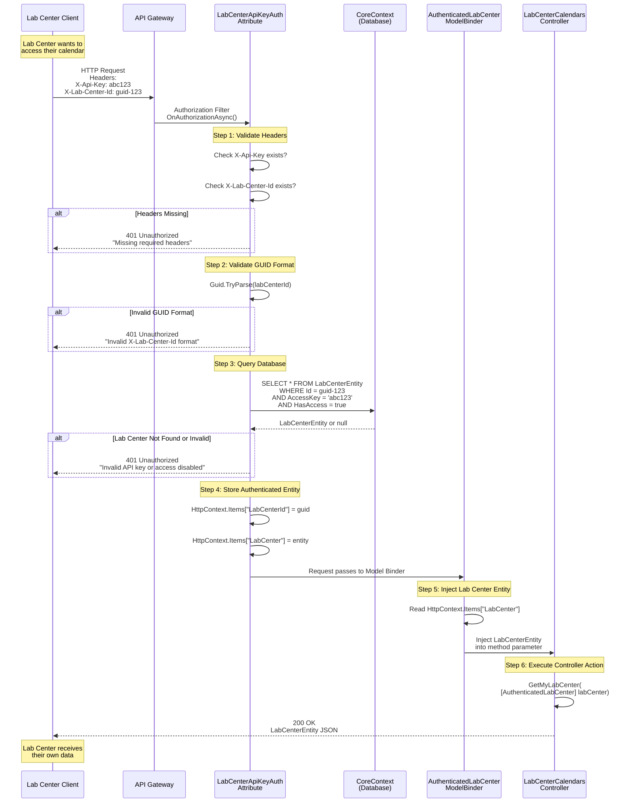

# Lab Center Authentication Flow

## Authentication Flow Steps

### 1. **Initial Request**
- Lab Center client sends HTTP request with two required headers:
  - `X-Api-Key`: Their unique API access key
  - `X-Lab-Center-Id`: Their unique GUID identifier

### 2. **Authorization Filter (`LabCenterApiKeyAuthAttribute`)**
The `[LabCenterApiKeyAuth]` attribute intercepts the request before it reaches the controller:

#### a. Header Validation
- Checks if both `X-Api-Key` and `X-Lab-Center-Id` headers are present
- Returns 401 if either header is missing

#### b. GUID Format Validation
- Validates that `X-Lab-Center-Id` is a valid GUID format
- Returns 401 if format is invalid

#### c. Database Authentication
- Queries `LabCenterEntity` table with three conditions:
  1. `Id` matches the provided GUID
  2. `AccessKey` matches the provided API key
  3. `HasAccess` is `true` (account not disabled)
- Returns 401 if no matching record found

#### d. Store Authenticated Entity
- Stores the authenticated `LabCenterEntity` in `HttpContext.Items["LabCenter"]`
- Stores the Lab Center ID in `HttpContext.Items["LabCenterId"]`
- Allows request to proceed to controller

### 3. **Model Binding (`AuthenticatedLabCenterModelBinder`)**
- Custom model binder retrieves the stored `LabCenterEntity` from `HttpContext.Items`
- Injects it into any controller parameter marked with `[AuthenticatedLabCenter]`

### 4. **Controller Execution**
- Controller method receives the authenticated `LabCenterEntity` as a parameter
- No manual authentication code needed in controller
- Lab Center can only access their own data

### 5. **Response**
- Controller returns appropriate response (e.g., lab center details, calendar data)
- Lab Center receives the data

## Security Features

1. **Double Authentication**: Both API key AND Lab Center ID must match
2. **Access Control**: `HasAccess` flag allows instant revocation
3. **No Password Storage**: Uses secure API keys instead
4. **Stateless**: No session management needed
5. **Injection Safety**: Authenticated entity is automatically injected, preventing tampering

## Error Responses

| Status | Error Message | Cause |
|--------|---------------|-------|
| 401 | Missing required headers | One or both headers not provided |
| 401 | Invalid X-Lab-Center-Id format | GUID parsing failed |
| 401 | Invalid API key or Lab Center ID, or access disabled | Authentication failed or access revoked |

---

**File Location:** `documentations/diagrams/LabCenterAuthentication.drawio.png`
**Created:** November 27, 2025
